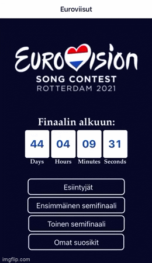
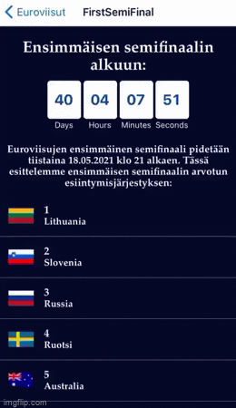
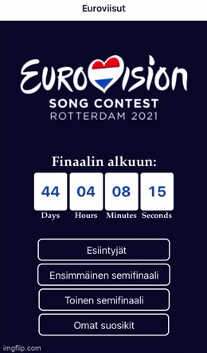

# Eurovision App
Eurovision app is created to especially to eurovision fans who wants to expands the eurovision experience, but anyone can join on the celebration of eurovision. :) This app is a part of mobile programming course in Haaga Helia University of Applied Sciences.

The main features of the app are the following: 
1. To track time before semifinals and final.

2. Check when different countries are performing and which semifinal.

3. To add your own favorites and give your own points to countries. 

# How can I use the Eurovision App?
You can start using eurovision app by Expo.io. Steps to take before seeing app on you phone:
1. Download Expo.io from App Store or Google Play.
2. Open the app and scan the QR-code.
3. Wait for the app to download.
4. Enjoy your usage!